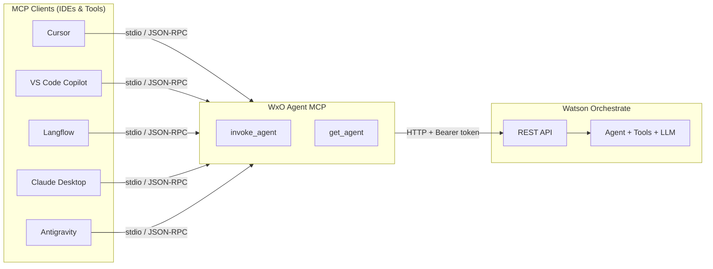
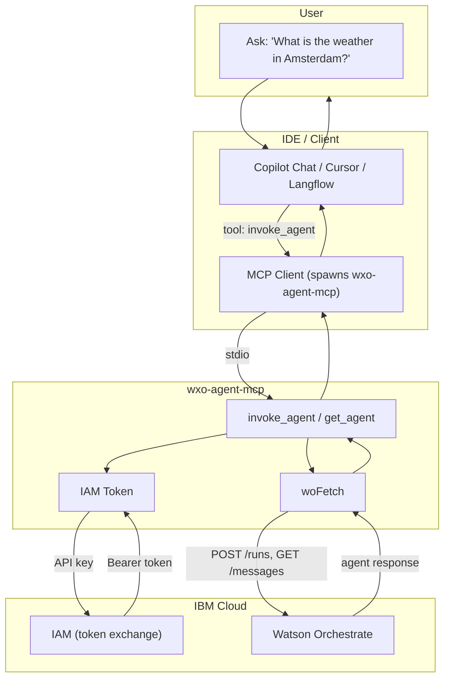
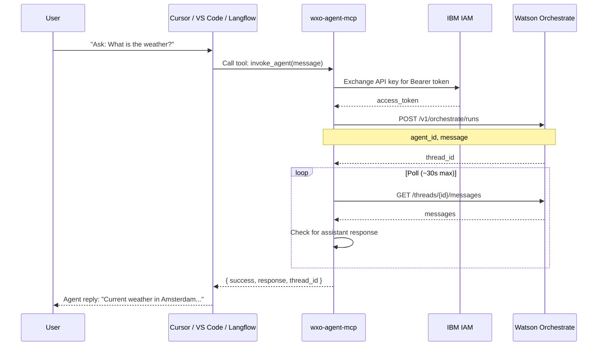
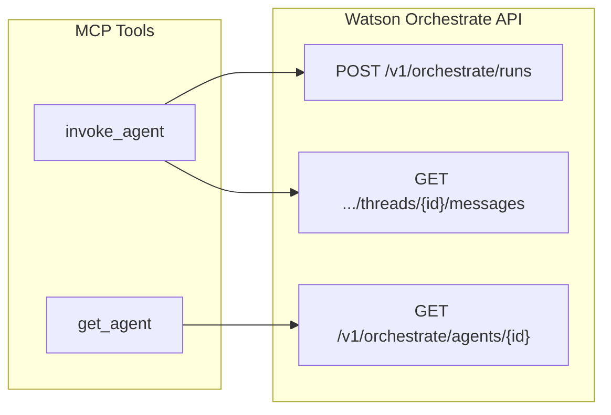

# WxO Agent MCP – Documentation

**Version:** 1.0.0  
**Author:** Markus van Kempen  
**License:** Apache-2.0

---

## Contents

- [Architecture](#architecture) – MCP as proxy, data flow, sequence, supported clients
- [Overview](#overview) – Purpose and comparison with wxo-builder-mcp-server
- [Project Structure](#project-structure)
- [Configuration](#configuration)
- [MCP Tools](#mcp-tools)
- [Question Examples](#question-examples)
- [Verification](#verification)
- [Running the Server](#running-the-server)
- [Testing in VS Code](#testing-locally-in-vs-code)
- [Testing in Langflow](#testing-in-langflow)
- [Troubleshooting](#troubleshooting)

---

## Architecture

### MCP as Proxy to Watson Orchestrate

WxO Agent MCP acts as a **proxy** between MCP-enabled clients (IDEs, AI assistants, flow builders) and IBM Watson Orchestrate. Clients communicate via **MCP over stdio** (JSON-RPC); the MCP server translates tool calls into Watson Orchestrate REST API requests.



### Data Flow



### invoke_agent Sequence



### Supported Clients

| Client | Config | Transport |
|--------|--------|-----------|
| **Cursor** | `.cursor/mcp.json` | stdio |
| **VS Code Copilot** | `.vscode/mcp.json` | stdio |
| **Langflow** | MCP Tools component (STDIO) | stdio |
| **Claude Desktop** | `claude_desktop_config.json` | stdio |
| **Antigravity** | MCP servers config | stdio |

All clients spawn the MCP server as a subprocess and communicate via **stdio** (stdin/stdout) using the MCP JSON-RPC protocol.

### Tool → API Mapping



---

## Overview

**WxO Agent MCP** is a minimal MCP (Model Context Protocol) server that invokes a single IBM Watson Orchestrate agent over HTTP. It is intended for AI assistants (Cursor, Claude Desktop, VS Code Copilot, etc.) that need to chat with one specific agent without managing tools, flows, or connections.

### Purpose

- Invoke a Watson Orchestrate agent remotely via MCP tool calls.
- Expose only two tools: `invoke_agent` (chat) and `get_agent` (agent details).
- Configure a single agent via environment variables; no runtime agent selection.

### Compared to wxo-builder-mcp-server

| Aspect | wxo-agent-mcp | wxo-builder-mcp-server |
|--------|---------------|------------------------|
| Purpose | Chat with one agent | Full dev toolkit |
| Agent config | Single `WO_AGENT_ID` or `WO_AGENT_IDs` | Multiple agents, `WO_AGENT_IDs` |
| Tools | 2 (`invoke_agent`, `get_agent`) | 30+ (list_skills, deploy_tool, etc.) |
| Use case | “Ask my agent” | Build and manage Watson Orchestrate resources |

---

## Project Structure

```
wxo-agent-mcp/
├── src/
│   ├── index.ts      # MCP server, tool handlers, invoke_agent & get_agent logic
│   ├── config.ts     # Env loading, WO_* config, URL normalization
│   └── auth.ts       # IAM token, woFetch for Watson Orchestrate API
├── tests/
│   └── verify.ts     # Verification script (get_agent + invoke_agent)
├── examples/
│   └── mcp.json      # Example MCP client config
├── package.json
├── tsconfig.json
├── .env.example
├── README.md
├── DOCUMENTATION.md
└── LICENSE
```

### Source Files

| File | Role |
|------|------|
| **src/index.ts** | MCP server setup, `invoke_agent` and `get_agent` tools. Uses Watson Orchestrate Runs API (`POST /v1/orchestrate/runs`), polls for messages via `GET /v1/orchestrate/threads/{id}/messages`. |
| **src/config.ts** | Loads `.env`, normalizes `WO_INSTANCE_URL` (fixes `ttps://` typo, adds `https://` when missing), resolves `WO_AGENT_ID` or `WO_AGENT_IDs` (first ID). |
| **src/auth.ts** | IAM token acquisition (IBM Cloud API key → Bearer token), `woFetch` for authenticated requests to Watson Orchestrate. |

---

## Configuration

### Environment Variables

| Variable | Required | Description |
|----------|----------|-------------|
| **WO_API_KEY** | Yes | IBM Cloud API key for Watson Orchestrate. |
| **WO_INSTANCE_URL** | Yes | Watson Orchestrate instance URL (e.g. `https://api.us-south.watson-orchestrate.cloud.ibm.com/instances/{id}` or `https://{id}.orchestrate.ibm.com`). |
| **WO_AGENT_ID** | One of WO_AGENT_ID / WO_AGENT_IDs | Agent ID to invoke. |
| **WO_AGENT_IDs** | One of WO_AGENT_ID / WO_AGENT_IDs | Comma-separated agent IDs; first is used. |
| **IAM_TOKEN_URL** | No | Default `https://iam.cloud.ibm.com/identity/token`. Override for private IAM. |

### URL Normalization

- Trailing slashes are removed.
- `ttps://` is corrected to `https://`.
- URLs without a scheme get `https://` prepended.

### Configuration Sources

1. `.env` in the project root.
2. `.env` in the current working directory.
3. MCP client `env` block (e.g. in Cursor `mcp.json`).
4. Shell environment variables.

---

## MCP Tools

### invoke_agent

Sends a user message to the configured agent and returns the assistant reply.

**Input:**

- `message` (string, required): User message to send.

**Output:** JSON like:

```json
{
  "success": true,
  "response": "The agent's reply text.",
  "thread_id": "uuid"
}
```

**Behavior:**

1. Calls `POST /v1/orchestrate/runs` with `agent_id` and `message`.
2. Polls `GET /v1/orchestrate/threads/{thread_id}/messages` for assistant messages.
3. Returns the last assistant text content (up to ~30s polling).
4. Throws on timeout or API errors.

### get_agent

Returns details of the configured agent.

**Input:** None.

**Output:** Full agent JSON from `GET /v1/orchestrate/agents/{id}` (name, description, tools, instructions, etc.).

---

## Question Examples

Example questions to ask in **Cursor**, **VS Code Copilot**, **Langflow**, or other MCP clients. The AI will call `invoke_agent` or `get_agent` to respond.

### invoke_agent (chat with the agent)

| Question | What the agent might do |
|----------|-------------------------|
| What is the weather in Amsterdam? | Use weather tool |
| What time is it in Tokyo? | Use World Time tool |
| Tell me a dad joke | Use Dad Jokes tool |
| What can you help me with? | Describe capabilities |
| Get the METAR for KJFK | Use aviation weather tool |
| Tell me about Brazil | Use REST Countries tool |
| What's the exchange rate for CAD to USD? | Use currency tool |
| Hello, who are you? | Introduce itself |

### get_agent (agent details)

| Question | Response |
|----------|----------|
| Use get_agent to show me the agent details | Agent name, description, tools, instructions |
| What tools does my agent have? | List of assigned tools |
| Show me the agent configuration | Full agent JSON |

### Natural-language style (AI selects the tool)

| Question |
|----------|
| Ask my Watson agent: What is the weather in London? |
| Chat with the agent: Tell me a dad joke |
| Use the agent to get the current time in New York |

### test:verify (terminal)

```bash
# Default
npm run test:verify

# Custom questions
npm run test:verify -- -ask "What is the weather in Amsterdam?"
npm run test:verify -- -ask "Tell me a dad joke"
npm run test:verify -- -ask "What time is it in Sydney?"
```

---

## Verification

The `test:verify` script exercises `get_agent` and `invoke_agent` against your env.

### Usage

```bash
# Default question: "Hello, who are you? What can you help me with?"
npm run test:verify

# Custom question
npm run test:verify -- -ask "What is the weather in Amsterdam?"
```

### Output

```
Config: { instanceUrl: '...', agentId: '...' }

--- get_agent ---
Agent: TimeWeatherAgent
Tools: 4

--- invoke_agent ---
User: What is the weather in Amsterdam?

Response from the Agent when invoke is:

TimeWeatherAgent replied:

Current weather in Amsterdam: ...

✅ wxo-agent-mcp verification passed
```

### Requirements

- `WO_API_KEY`, `WO_INSTANCE_URL`, and `WO_AGENT_ID` (or `WO_AGENT_IDs`) set.
- `tsx` dev dependency for running the TypeScript script.

---

## Running the Server

### Local

```bash
npm install
npm run build
node dist/index.js
```

The server runs on stdio. MCP clients spawn it as a subprocess and communicate via JSON-RPC.

### MCP Client Config

**Cursor** (`.cursor/mcp.json`):

```json
{
  "mcpServers": {
    "wxo-agent": {
      "command": "node",
      "args": ["/absolute/path/to/wxo-agent-mcp/dist/index.js"],
      "env": {
        "WO_API_KEY": "your-key",
        "WO_INSTANCE_URL": "https://xxx.orchestrate.ibm.com",
        "WO_AGENT_ID": "your-agent-id"
      }
    }
  }
}
```

**With npx** (after publishing):

```json
{
  "mcpServers": {
    "wxo-agent": {
      "command": "npx",
      "args": ["-y", "wxo-agent-mcp"],
      "env": { "WO_API_KEY": "...", "WO_INSTANCE_URL": "...", "WO_AGENT_ID": "..." }
    }
  }
}
```

---

## Testing Locally in VS Code

This section assumes the MCP server is named **`wxo-agent`** in `mcp.json` (workspace `.vscode/mcp.json` or Cursor `.cursor/mcp.json`).

### 1. Setup

1. Open the `wxo-agent-mcp` folder in VS Code (File → Open Folder).
2. Ensure `.env` has `WO_API_KEY`, `WO_INSTANCE_URL`, `WO_AGENT_ID` (or `WO_AGENT_IDs`).
3. Run `npm run build` so `dist/index.js` exists.
4. Ensure `.vscode/mcp.json` contains:

```json
{
  "servers": {
    "wxo-agent": {
      "type": "stdio",
      "command": "node",
      "args": ["${workspaceFolder}/dist/index.js"],
      "envFile": "${workspaceFolder}/.env"
    }
  }
}
```

### 2. Verification script (terminal)

From the integrated terminal (Ctrl+`):

```bash
npm run test:verify
# Or with custom question:
npm run test:verify -- -ask "What is the weather in Amsterdam?"
```

### 3. Invoking wxo-agent in Copilot Chat

1. Open **Copilot Chat** (View → Copilot Chat, or `Ctrl+Shift+I`).
2. On first use, VS Code may prompt to trust the MCP server; approve it.
3. The `wxo-agent` tools (`invoke_agent`, `get_agent`) become available when the server is connected.

**Example prompts that invoke the agent:**

| Prompt | Effect |
|--------|--------|
| *Use the invoke_agent tool to ask: What is the weather in Amsterdam?* | Direct tool call |
| *Call invoke_agent with message "What time is it in Tokyo?"* | Direct tool call |
| *Ask my Watson agent: Tell me a dad joke* | Natural; Copilot selects the tool |
| *Use get_agent to show me the agent details* | Returns agent config and tools |
| *Chat with the agent: What can you help me with?* | Natural; Copilot selects the tool |

**Tips if the tool is not invoked:**

- Mention the tool explicitly: *Use invoke_agent to ask the agent: [your question]*

**Skip get_agent for capability questions:** Copilot may call `get_agent` first to fetch config. To get only the agent's answer, ask: *Use invoke_agent to ask: What can you do?* The tool descriptions nudge the AI to prefer `invoke_agent` for "what can you do" / "list capabilities".
- Restart VS Code and reopen the folder
- Check that `dist/index.js` exists and `.env` is valid

### 4. Debug configurations

`.vscode/launch.json` provides:

- **Run wxo-agent-mcp** – launch the MCP server (F5)
- **Run test:verify** – run the verification script (F5)

Use Run and Debug (Ctrl+Shift+D) and select a configuration.

---

## Testing in Langflow

Langflow can use the **wxo-agent** MCP server via the MCP Tools component (STDIO mode). Node.js must be installed (Langflow uses it to run the server).

### Setup

1. Build the server: `npm run build` (produces `dist/index.js`).
2. Open Langflow and create or open a flow.
3. Add an **MCP Tools** component.
4. Click **Add MCP Server** and choose **STDIO**.
5. Configure:

| Field | Value |
|-------|-------|
| **Name** | `wxo-agent` |
| **Command** | `node` |
| **Arguments** | `["/absolute/path/to/wxo-agent-mcp/dist/index.js"]` |
| **Environment Variables** | `WO_API_KEY`, `WO_INSTANCE_URL`, `WO_AGENT_ID` (or `WO_AGENT_IDs`) as key-value pairs |

**Alternative (npx, after publishing):**

- **Command:** `npx`
- **Arguments:** `["-y", "wxo-agent-mcp"]`
- **Environment Variables:** same as above

6. In the MCP Tools component, enable **Tool mode** in the header menu.
7. Connect the MCP Tools component’s **Toolset** port to an **Agent** component’s **Tools** port.
8. Add **Chat Input** and **Chat Output** if needed.

### Example prompts in Playground

- *Use invoke_agent to ask: What is the weather in Amsterdam?*
- *Ask my Watson agent: Tell me a dad joke*
- *Use get_agent to show the agent’s tools*

### Troubleshooting

- **500 Internal Server Error:** Tool output is flattened for Langflow's DataFrame. Rebuild (`npm run build`) and retry. If it persists: ensure Node.js is installed; use absolute path to `dist/index.js`; set env vars in MCP config or Langflow's `.env`.
- **Node.js in Docker:** If Langflow runs in Docker, Node.js must be installed in the image. Rebuild the container if needed.
- **Absolute path:** Use the full path to `dist/index.js` (e.g. `/Users/you/projects/wxo-agent-mcp/dist/index.js`).
- **Env vars:** Langflow passes env from its `.env` to MCP. Add `WO_API_KEY`, `WO_INSTANCE_URL`, `WO_AGENT_ID` to Langflow’s `.env` if you prefer not to set them in the UI.

---

## Troubleshooting

| Symptom | Cause | Fix |
|---------|-------|-----|
| `URL scheme "ttps" is not supported` | Typo in `WO_INSTANCE_URL` | Use `https://` or rely on auto-correction. |
| `Missing required environment variables` | Missing env vars | Set `WO_API_KEY`, `WO_INSTANCE_URL`, `WO_AGENT_ID` (or `WO_AGENT_IDs`). |
| `Timed out waiting for agent response` | Slow agent / tool use | Increase poll count or delay in `index.ts`; check agent responsiveness. |
| `IAM failed` | Invalid API key | Verify `WO_API_KEY` and regenerate if needed. |
| `Get agent failed: 404` | Invalid agent ID | Check `WO_AGENT_ID` against your Watson Orchestrate instance. |
| `Run failed: 500` (Langflow) | DataFrame / output format | Rebuild; tool output is now flattened. Check Node.js and env vars. |

---

## API Dependencies

- **Watson Orchestrate** (HTTP REST):
  - `POST /v1/orchestrate/runs` – start a run
  - `GET /v1/orchestrate/threads/{id}/messages` – get thread messages
  - `GET /v1/orchestrate/agents/{id}` – get agent
- **IBM Cloud IAM** – exchange API key for Bearer token.

---

## License

Apache-2.0. See [LICENSE](LICENSE).
